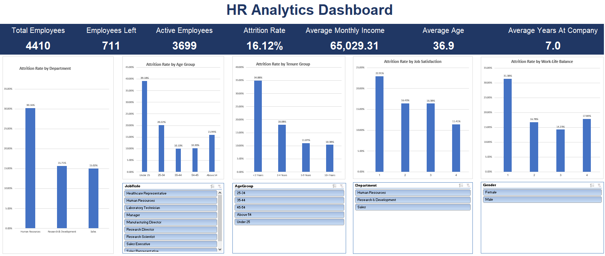

# HR Analytics Excel Project

An interactive **HR Analytics & Employee Attrition Dashboard** built using Microsoft Excel.

The project analyzes employee data to identify patterns related to attrition, job satisfaction, work-life balance, employee tenure, age groups, and departments.

---

## Project Objective

The main objective of this project is to analyze employee attrition and identify the factors associated with employees leaving the company.

The analysis focuses on questions such as:

- Which department has the highest attrition rate?
- Which age groups are most likely to leave?
- Does employee tenure affect attrition?
- Is job satisfaction associated with employee retention?
- How does work-life balance relate to attrition?
- Is there a difference in income between active employees and employees who left?

---

## Dataset

The dataset contains information for **4,410 employees** and was originally created by IBM Watson Analytics for educational purposes.

The data was distributed across three files:

- `general_data.csv`
- `employee_survey_data.csv`
- `manager_survey_data.csv`

The datasets were merged using `EmployeeID` as the unique key.

---

## Data Cleaning

Before performing the analysis, several data quality checks were completed:

- Checked for duplicate Employee IDs
- Checked for blank and missing values
- Identified `NA` values
- Applied median imputation where appropriate
- Validated numeric ranges
- Reviewed categorical values
- Removed constant columns that provided no analytical value
- Validated EmployeeID before merging the datasets

### Missing Value Treatment

Median imputation was used for limited missing values in:

- `TotalWorkingYears`
- `NumCompaniesWorked`
- Employee satisfaction survey fields

---

## Data Preparation

The three datasets were merged into a single master table using `EmployeeID`.

Excel lookup techniques used:

- `INDEX + MATCH`
- `VLOOKUP`

Additional calculated columns were created, including:

- `EmployeeStatus`
- `AgeGroup`
- `TenureGroup`
- `AttritionFlag`

---

## Excel Skills Used

The project demonstrates practical use of:

- IF
- IFS
- COUNTIF
- COUNTIFS
- SUM
- SUMIFS
- AVERAGE
- AVERAGEIFS
- VLOOKUP
- INDEX + MATCH
- Excel Tables
- PivotTables
- PivotCharts
- Slicers
- Dynamic KPI Cards
- Data Cleaning
- Data Validation
- Dashboard Design

---

## Dashboard KPIs

The dashboard includes:

- **Total Employees:** 4,410
- **Employees Left:** 711
- **Active Employees:** 3,699
- **Attrition Rate:** 16.12%
- **Average Monthly Income:** 65,029.31
- **Average Age:** 36.92
- **Average Years at Company:** 7.0

The KPIs dynamically update when dashboard slicers are used.

---

## Dashboard Analysis

The dashboard includes:

- Attrition Rate by Department
- Attrition Rate by Age Group
- Attrition Rate by Tenure Group
- Attrition Rate by Job Satisfaction
- Attrition Rate by Work-Life Balance

Interactive slicers allow users to filter the dashboard by:

- Department
- Gender
- Age Group
- Job Role

---

## Key Insights

- **Human Resources** recorded the highest departmental attrition rate at **30.16%**.
- Employees **under 25** had the highest age-group attrition rate at **39.18%**.
- Employees with **less than 2 years of tenure** had an attrition rate of **34.88%**.
- Employees with the lowest job satisfaction had a **22.91%** attrition rate, compared with **11.41%** for employees with the highest satisfaction level.
- Employees with the poorest work-life balance had an attrition rate of **31.38%**.
- Employees who left had a lower average monthly income (**61,682.62**) than active employees (**65,672.60**).

---

## HR Recommendations

Based on the analysis:

- Focus on early-tenure retention programs, especially for employees with less than 2 years at the company.
- Improve employee satisfaction and work-life balance initiatives.
- Investigate the high attrition rate within the Human Resources department.
- Review compensation and career development opportunities for employees at higher risk of leaving.

---

## Project Files

- `HR_Analytics_Excel_Project_Final.xlsx` — Complete interactive Excel project
- `HR_Analytics_Dashboard.PNG` — Dashboard preview
- `README.md` — Project documentation

---

## Tool

**Microsoft Excel**

---

## Note

This project was created for educational and portfolio purposes using a synthetic HR dataset.
